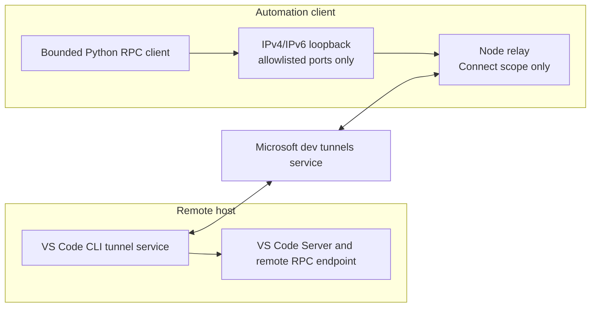
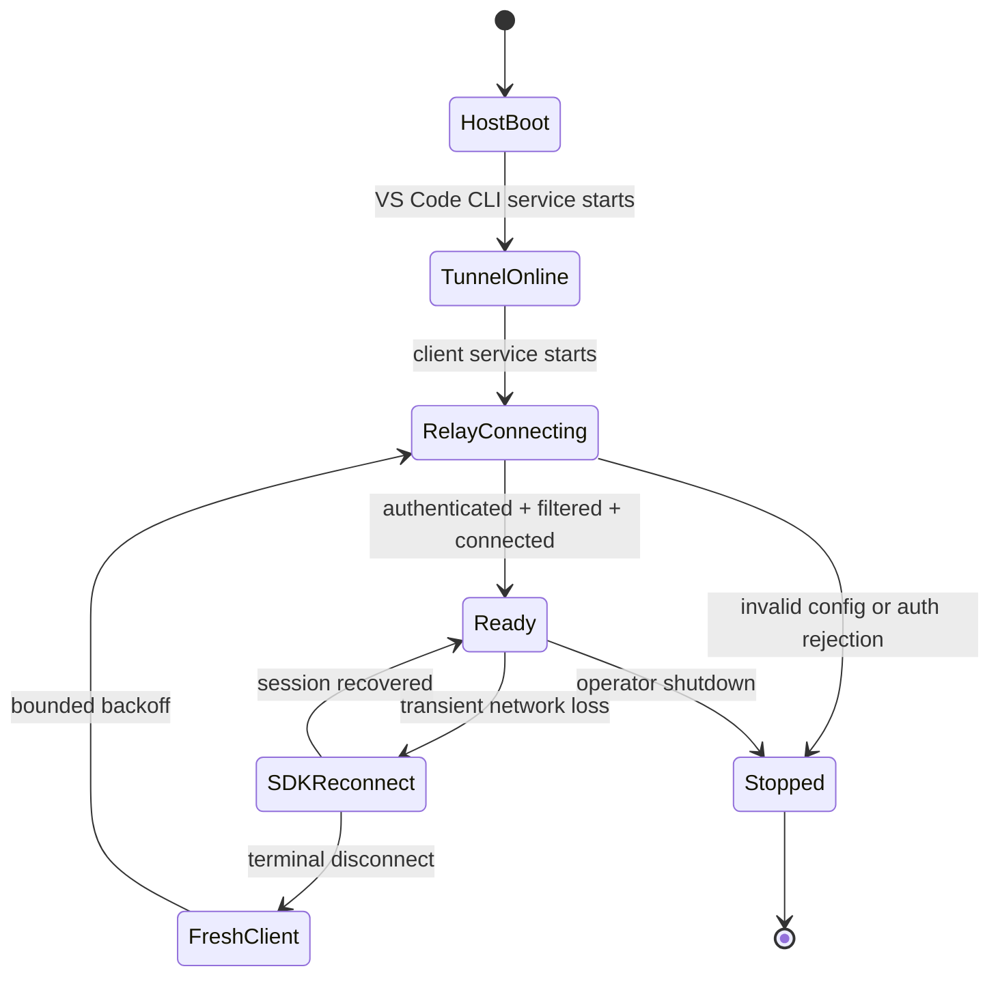
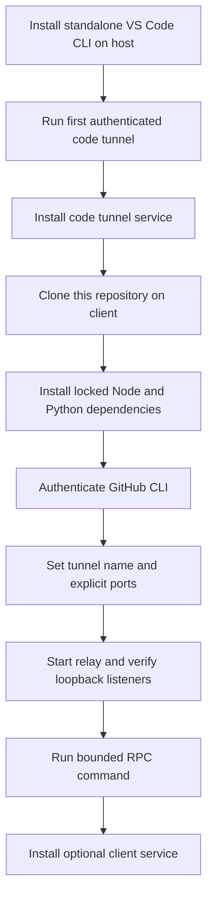

# Remote-SSH-Tunnel

[](https://github.com/sumitake/Remote-SSH-Tunnel/actions/workflows/ci.yml)
[](https://github.com/sumitake/Remote-SSH-Tunnel/actions/workflows/codeql.yml)
[](https://github.com/sumitake/Remote-SSH-Tunnel/actions/workflows/secret-scan.yml)

A headless, self-recovering client bridge for an existing Visual Studio Code
Remote Tunnel. It combines a loopback-only Microsoft dev-tunnels relay with a
bounded MessagePack RPC client so automation can reach explicitly forwarded
remote services without a desktop editor.

This is an independent interoperability project. It does not create the host
tunnel, replace OpenSSH, redistribute VS Code, or provide a general remote shell.
The host must already run an authenticated VS Code CLI tunnel.

## What it provides

- A Node.js relay built on Microsoft's official dev-tunnels SDK.
- Friendly VS Code tunnel-name discovery or an explicit tunnel ID/cluster pair.
- A mandatory port allowlist and loopback-only listeners (`127.0.0.1`/`::1`).
- Automatic SDK reconnect plus a fresh-client recovery loop after terminal disconnects.
- A Python RPC CLI with direct executable/argv semantics and no implicit shell.
- Protocol, frame, stream-state, deadline, and aggregate-output bounds.
- Safe rendering of untrusted remote output; raw bytes require an explicit opt-in.
- systemd user and launchd examples for long-running client-side deployment.
- Matrix CI, CodeQL, Gitleaks, Dependabot, and repository/license validation.

## System architecture



The VS Code CLI owns host registration, authentication, VS Code Server, and the
outbound service connection. This repository's relay authenticates separately,
requests only a tunnel `connect` token, rejects ports outside its allowlist, and
opens local listeners only on loopback. The RPC CLI treats the local endpoint as
untrusted even after tunnel authentication.

See [Architecture and operations](docs/architecture-and-operations.md) for the
full trust model, sequence diagrams, recovery states, deployment, update, and
decommission workflows.

## Production lifecycle



There are three recovery layers:

1. The VS Code CLI service returns after a host restart.
2. The dev-tunnels SDK reconnects recoverable sessions while preserving the
   pre-installed port filter.
3. The relay supervisor disposes a terminal client, creates a fresh filtered
   client, and reconnects with capped exponential backoff. The operating-system
   service manager restarts the process after an unrecoverable process failure.

Configuration and authentication errors fail closed instead of creating a
restart storm.

## Deployment flow



## Requirements

### Remote host

- A supported 64-bit Linux host for the CLI-only example (`x86_64` or `aarch64`).
- Outbound HTTPS access to the VS Code and dev-tunnels services.
- A GitHub or Microsoft account accepted by VS Code Remote Tunnels.

### Automation client

- Node.js 20 or newer.
- Python 3.11 or newer.
- GitHub CLI (`gh`) authenticated to the same account that can access the tunnel.
- Outbound HTTPS and WebSocket access to the dev-tunnels service.

## 1. Install the CLI-only host

The official [VS Code Remote Tunnels CLI instructions](https://code.visualstudio.com/docs/remote/tunnels#_using-the-code-cli)
provide a standalone archive for machines without VS Code Desktop. The following
headless Linux commands select the current stable x64 or ARM64 archive and install
the `code` binary onto `PATH`:

```bash
set -eu

case "$(uname -m)" in
  x86_64|amd64) cli_arch="x64" ;;
  aarch64|arm64) cli_arch="arm64" ;;
  *) echo "Unsupported architecture: $(uname -m)" >&2; exit 1 ;;
esac

tmpdir="$(mktemp -d)"
trap 'rm -rf "$tmpdir"' EXIT

curl --fail --location --proto '=https' --tlsv1.2 \
  "https://code.visualstudio.com/sha/download?build=stable&os=cli-alpine-${cli_arch}" \
  --output "$tmpdir/vscode_cli.tar.gz"
tar -xzf "$tmpdir/vscode_cli.tar.gz" -C "$tmpdir"
"$tmpdir/code" --version

sudo install -m 0755 "$tmpdir/code" /usr/local/bin/code
code --version
```

Without root access, install to `~/.local/bin/code` and add that directory to
`PATH`. While running directly from the extracted standalone archive, use
`./code` in every command below. Use `code` only after installing it on `PATH`.

Start the tunnel once to accept the server license, authenticate, and choose the
friendly machine name:

```bash
code tunnel --accept-server-license-terms
```

The CLI prints a device-authentication URL and code. Complete authentication,
confirm the tunnel is reachable, then stop the foreground process with `Ctrl-C`.
Install the persistent service:

```bash
code tunnel service install
```

The service is the normal production path and starts after device restarts. To
start the tunnel manually for initial setup or diagnosis, run:

```bash
code tunnel
```

Useful lifecycle commands:

```bash
code tunnel --help
code tunnel service uninstall
code tunnel unregister
```

On Linux systems where a user service stops when the user logs out, an
administrator may need `loginctl enable-linger <service-user>`. Confirm that the
host's service remains active after a reboot before deploying the client relay.

## 2. Install the client tools

```bash
git clone https://github.com/sumitake/Remote-SSH-Tunnel.git
cd Remote-SSH-Tunnel

npm ci
python3 -m venv .venv
.venv/bin/python -m pip install .
```

Authenticate the GitHub CLI. The relay reads its token from the credential store
without placing it in command-line arguments:

```bash
gh auth login --hostname github.com
gh auth status --hostname github.com
```

`GITHUB_TOKEN` or `GH_TOKEN` is also accepted for ephemeral automation. The relay
copies the value once, deletes both variables from its process environment, and
does not launch child processes afterward. Never put a token in a relay CLI flag,
service file, checked-in environment file, or log.

## 3. Configure and run the relay

Copy the non-secret configuration example outside the repository:

```bash
install -d -m 0700 "$HOME/.config/remote-ssh-tunnel"
install -m 0600 config/relay.env.example \
  "$HOME/.config/remote-ssh-tunnel/relay.env"
```

Set `REMOTE_SSH_TUNNEL_NAME` to the friendly name chosen by `code tunnel`. Set
`REMOTE_SSH_TUNNEL_PORTS` to only the remote ports this client needs. The relay
fails if the name matches zero or multiple VS Code tunnels.

```bash
set -a
. "$HOME/.config/remote-ssh-tunnel/relay.env"
set +a
node bin/remote-ssh-tunnel-relay.js
```

For advanced deterministic selection, omit `REMOTE_SSH_TUNNEL_NAME` and set both
`REMOTE_SSH_TUNNEL_ID` and `REMOTE_SSH_TUNNEL_CLUSTER_ID`. Do not configure both
selection modes.

Project logs contain status, retry count, delay, and allowed port numbers. They do
not contain credentials or tunnel selectors. The upstream SDK also emits local
forwarding notices with loopback addresses and port numbers. It mirrors the
configured `127.0.0.1` listener on `::1` when IPv6 loopback is available. Verify
that every listener is loopback-only:

```bash
lsof -nP -iTCP -sTCP:LISTEN | grep -E '127\.0\.0\.1|\[::1\]'
```

## 4. Run a remote RPC command

The RPC port must be one of the relay's explicit allowed ports and must expose a
compatible VS Code remote RPC endpoint. Run an executable and exact argv without
an implicit shell:

```bash
.venv/bin/remote-ssh-tunnel-rpc \
  --port 45001 \
  -- /usr/bin/id -un
```

Forward only named environment variables:

```bash
.venv/bin/remote-ssh-tunnel-rpc \
  --port 45001 \
  --pass-env LANG \
  -- /usr/bin/env
```

Shell syntax is never inferred. If shell behavior is intentional, name the shell
and its arguments explicitly:

```bash
.venv/bin/remote-ssh-tunnel-rpc \
  --port 45001 \
  -- /bin/sh -lc 'printf "%s\\n" "$HOME"'
```

Remote output is decoded and control characters are visibly escaped by default.
`--raw-output` preserves bytes for trusted binary pipelines but is unsafe when
attached to a terminal.

## 5. Run the client relay as a service

The [systemd user template](deploy/systemd/user/remote-ssh-tunnel-relay.service)
assumes this repository is at `~/Remote-SSH-Tunnel` and configuration is at
`~/.config/remote-ssh-tunnel/relay.env`:

```bash
install -d "$HOME/.config/systemd/user"
install -m 0644 deploy/systemd/user/remote-ssh-tunnel-relay.service \
  "$HOME/.config/systemd/user/"
systemctl --user daemon-reload
systemctl --user enable --now remote-ssh-tunnel-relay.service
systemctl --user status remote-ssh-tunnel-relay.service
journalctl --user -u remote-ssh-tunnel-relay.service -f
```

For macOS, edit the absolute paths and non-secret selector values in the
[launchd example](deploy/launchd/com.remote-ssh-tunnel.relay.plist.example), copy
it to `~/Library/LaunchAgents/`, and validate it with `plutil -lint` before
loading it.

## Operational workflows

| Workflow | Host | Client | Positive verification |
| --- | --- | --- | --- |
| Cold start | VS Code CLI service starts | relay service starts | loopback listeners exist; relay status is connected |
| Host or network power loss | service restarts after host boot | SDK reconnects or creates a fresh client | RPC read-only command returns expected output |
| Planned update | update CLI, then restart host service | pull a reviewed release, install locks, restart relay | tests pass and listeners remain loopback-only |
| Credential expiry | host reauthenticates if required | `gh auth status`, then restart relay | management lookup and connect succeed |
| Port change | expose the intended host port | replace explicit client allowlist and restart | old listener closes; only new listener opens |
| Decommission | uninstall service and unregister tunnel | stop relay, remove service/config | no tunnel registration and no local listeners |

The exact recovery, rollback, health-check, and decommission procedures are in
[Architecture and operations](docs/architecture-and-operations.md).

## Security model

- **Least network exposure:** the configured listener address is the IPv4
  loopback; the SDK may mirror it on IPv6 loopback. A pre-connect event filter
  cancels every unlisted port, and no wildcard interface is exposed.
- **Least tunnel privilege:** management requests ask only for the `connect`
  scope. The project does not create, update, or delete tunnels.
- **Credential containment:** tokens never enter argv, config objects, examples,
  logs, fixtures, or generic error serialization.
- **Direct execution:** command and argv remain separate. Environment forwarding
  is empty by default and opt-in by variable name.
- **Hostile-protocol handling:** MessagePack buffers, maps, arrays, strings,
  binary fields, stream transitions, deadlines, and total output are bounded.
- **Supply chain:** dependency locks, a zero-vulnerability npm audit, full-SHA
  action pins, CodeQL, Gitleaks, Dependabot, and protected-branch checks.

Read [SECURITY.md](SECURITY.md) before production deployment.

## Caveats

- The MessagePack RPC interface is not a stable public VS Code API. This release
  supports observed protocol version 5 and fails closed on any other version.
- A compatible RPC endpoint must already be exposed by the remote VS Code
  environment. The relay alone does not create it.
- VS Code documents Remote Tunnel instances as single-user/single-client systems.
- Microsoft applies tunnel count, bandwidth, and abuse-prevention limits that may
  change independently of this repository.
- The VS Code CLI, Server, Remote extensions, and cloud service remain governed by
  Microsoft's licenses, terms, availability, and authentication behavior.
- Loopback reduces network exposure but does not isolate mutually untrusted local
  users who can access one another's processes or sockets.

## Repository workflows

- `CI`: Node.js 20/22/24 and Python 3.11/3.12/3.13/3.14 tests, lint, formatting,
  package audit, executable smoke checks, and repository validation.
- `CodeQL`: JavaScript/TypeScript and Python analysis.
- `Secret Scan`: full-history Gitleaks scan on pushes, pull requests, and a weekly schedule.
- `Dependabot`: weekly GitHub Actions, npm, and pip update pull requests.
- `main`: pull request review, required checks, code-owner review, linear history,
  conversation resolution, and no force pushes or deletion.

## Licensing and attribution

Original runtime code and repository documentation are available under the root
[MIT License](LICENSE). Generalized material under
[`assets/vscode-interface/`](assets/vscode-interface/README.md) is separately
attributed and licensed under CC-BY-4.0, matching Microsoft's
[`vscode-remote-release` repository license](https://github.com/microsoft/vscode-remote-release/blob/main/LICENSE-repository).

No VS Code extension binary or product code is redistributed. Microsoft's
separate [extension product terms](https://github.com/microsoft/vscode-remote-release/blob/main/LICENSE-extensions)
continue to apply to the VS Code components users install independently. See
[THIRD_PARTY_NOTICES.md](THIRD_PARTY_NOTICES.md) for dependency notices.
