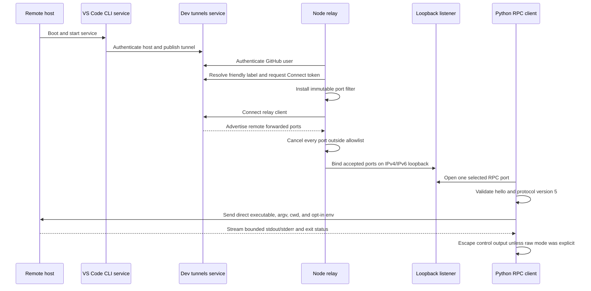
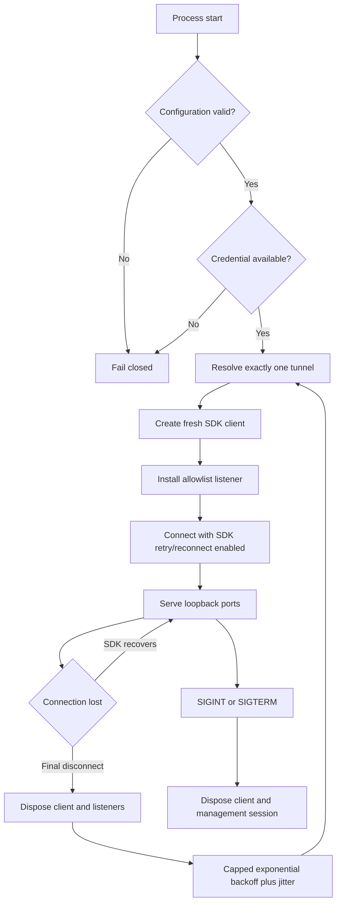

# Architecture and Operations

This page is the detailed production reference for VSC-RemoteSSH. The root
README remains the deployment quick start.

## Responsibility boundaries

| Component | Runs on | Owns | Does not own |
| --- | --- | --- | --- |
| VS Code CLI | remote host | tunnel registration, host authentication, VS Code Server, host service lifecycle | client relay policy |
| Microsoft dev tunnels | cloud service | authenticated relay transport and tunnel access tokens | local process policy or RPC validation |
| Node relay | automation client | friendly-name lookup, connect-only token request, loopback listeners, port filtering, reconnect | host tunnel creation or remote command semantics |
| Python RPC CLI | automation client | protocol validation, direct command request, stream routing, limits, safe output | tunnel registration or arbitrary port discovery |
| systemd/launchd | each applicable machine | restart after boot or process failure | application protocol correctness |

## End-to-end sequence



## Host bootstrap

1. Download the current standalone VS Code CLI over HTTPS for the host architecture.
2. Run `./code tunnel` from the extracted directory, or `code tunnel` after the
   binary is installed on `PATH`.
3. Accept the server license and complete device authentication.
4. Choose a unique friendly tunnel name and verify an interactive connection.
5. Stop the foreground tunnel and run `code tunnel service install`.
6. Reboot the host and prove the tunnel returns without an interactive login.

The host service makes outbound connections; the documented VS Code design does
not require opening an inbound WAN firewall port.

## Relay state machine



Every application-level recovery creates a new SDK client. Its immutable port
filter is registered synchronously before `connect()` runs. The previous client
is disposed before backoff. This prevents reconnect paths from bypassing the
allowlist or leaving orphan listeners. On operator shutdown, the relay also
cancels the SDK connection token and disposes both clients. A short entrypoint
fallback exits the process only if the upstream SDK leaves an idle transport
handle after reporting disposal complete.

## RPC transaction

1. Connect to the selected local host and port with a finite timeout.
2. Feed bytes into a MessagePack unpacker with explicit frame, string, binary,
   array, map, and extension limits.
3. Require a map containing a bounded software version and protocol version 5.
4. Echo the advertised software version in the protocol handshake.
5. Generate a random positive request ID and send `spawn` with a separate command
   and argv, optional cwd, and an empty-by-default environment map.
6. Require exactly three unique stream IDs: stdin, stdout, and stderr. Close stdin
   explicitly and reject data on that stream.
7. Reject data before stream advertisement, unknown IDs, duplicate transitions,
   non-byte payloads, oversized output, malformed responses, and invalid exits.
8. Close the socket on success, timeout, limit violation, protocol failure, or
   local interruption.

The client never interprets a command string. Calling `/bin/sh -lc` is an explicit
operator choice and moves shell parsing into that named remote process.

## Security model

### Assets protected

- GitHub access tokens and credential-store contents.
- Tunnel metadata, remote host identity, and private service topology.
- The client host's network exposure and local account boundary.
- The integrity of remote command arguments and environment values.
- Client memory, terminal state, and availability when consuming remote frames.

### Trust boundaries

- GitHub and Microsoft authentication services are external trusted dependencies.
- The tunnel service and SDK transport are trusted for authenticated transport,
  not for local port policy.
- The remote RPC endpoint and its output are untrusted inputs.
- Loopback is a single-host boundary, not a substitute for local user isolation.
- Service configuration is readable by its owning account and must contain no token.

### Enforced invariants

- Listener configuration is a constant `127.0.0.1`; the SDK may mirror accepted
  ports on `::1`, and no wildcard override exists.
- Every allowed port is an explicit integer from 1 through 65535.
- Every rejected port-forward event is cancelled before local acceptance.
- Tokens do not enter argv, serialized config, fixtures, logs, or generic errors.
- GitHub token environment variables are deleted before asynchronous work.
- No child process is launched after a token is present in relay memory.
- Protocol resource use is bounded before remote bytes are emitted locally.
- Terminal controls are escaped unless the operator opts into raw output.

## Deployment workflow

### Host

1. Install the standalone CLI at a stable path.
2. Authenticate and register the friendly name.
3. Install the tunnel service.
4. Verify restart survival and outbound network policy.

### Client

1. Check out a reviewed tag or commit.
2. Run `npm ci` and install the Python package in a dedicated virtual environment.
3. Authenticate `gh` under the service account that owns or can access the tunnel.
4. Store only non-secret selector and allowlist settings in a mode-0600 file.
5. Run the relay in the foreground and verify loopback-only listeners.
6. Execute a read-only RPC health command.
7. Install the systemd or launchd service and repeat the health check after reboot.

## Update and rollback

### Host CLI

1. Record the working CLI version and current service state.
2. Stop the host service during a planned window.
3. Replace the standalone binary at its stable path.
4. Start the service and verify tunnel registration plus a client connection.
5. If verification fails, restore the previous binary and restart the service.

### Client project

1. Review the changelog, dependency updates, protocol compatibility, and CI results.
2. Stop the relay service.
3. Preserve the current checkout or tag as the rollback target.
4. Install the new lockfiles in a clean environment and run all local checks.
5. Start the relay and perform a read-only RPC health command.
6. Roll back the checkout and dependency install if listeners, authentication, or
   the RPC health command fail.

## Health checks

Positive checks are required; a process merely existing is not enough.

```bash
# Host: inspect supported commands and the installed binary.
code --version
code tunnel --help

# Client: relay help loads the real SDK dependency graph.
node bin/remote-ssh-tunnel-relay.js --help

# Client: confirm listeners are loopback-only.
lsof -nP -iTCP -sTCP:LISTEN | grep -E '127\.0\.0\.1|\[::1\]'

# Client: run a harmless command through the configured RPC port.
.venv/bin/remote-ssh-tunnel-rpc --port 45001 -- /usr/bin/id -un
```

A production monitor should distinguish:

- host tunnel absent;
- management authentication rejected;
- tunnel label missing or ambiguous;
- relay disconnected but retrying;
- expected loopback port absent;
- TCP port open but RPC protocol unhealthy;
- RPC healthy but the requested remote dependency unhealthy.

## Failure and recovery matrix

| Failure | Expected behavior | Operator action if persistent |
| --- | --- | --- |
| Host power loss | host tunnel service returns after boot; client reconnects | inspect host service and outbound network |
| Client power loss | relay service starts after boot and resolves tunnel again | inspect service manager and GitHub CLI auth |
| Network interruption | SDK reconnects, then supervisor creates a fresh client if needed | confirm dev-tunnels endpoints are reachable |
| Expired/revoked token | relay fails authentication without logging token material | run `gh auth status`, reauthenticate, restart |
| Friendly name missing | fail closed before a relay client connects | verify host registration and exact name |
| Friendly name ambiguous | fail closed instead of choosing arbitrarily | rename or unregister the stale tunnel |
| Unexpected remote port | event is cancelled; no local listener opens | correct host exposure or client allowlist |
| RPC protocol version change | client exits with protocol error | upgrade only after compatibility tests |
| Oversized/malformed RPC output | socket closes before exceeding local bound | inspect the remote endpoint; do not raise limits blindly |

## Decommission

1. Stop and disable the client relay service.
2. Confirm all local forwarded listeners have closed.
3. Remove the client service file and non-secret selector configuration.
4. Run `code tunnel service uninstall` on the host.
5. Run `code tunnel unregister` if the account association should also be removed.
6. Verify the friendly tunnel no longer appears to authenticated clients.
7. Revoke credentials only when they were dedicated to this deployment or exposed.

## Compatibility and upstream dependencies

- Node.js: 20 and newer, continuously tested on 20, 22, and 24.
- Python: 3.11 and newer, continuously tested on 3.11 through 3.14.
- Microsoft dev-tunnels SDK: pinned to 1.3.50.
- MessagePack Python: pinned to 1.2.1.
- RPC protocol: observed version 5 only.

The VS Code Remote RPC interface is private and can change without semantic
versioning for this project. Upstream drift must be handled as a compatibility
change with fixtures, tests, live read-only verification, and a changelog entry.
